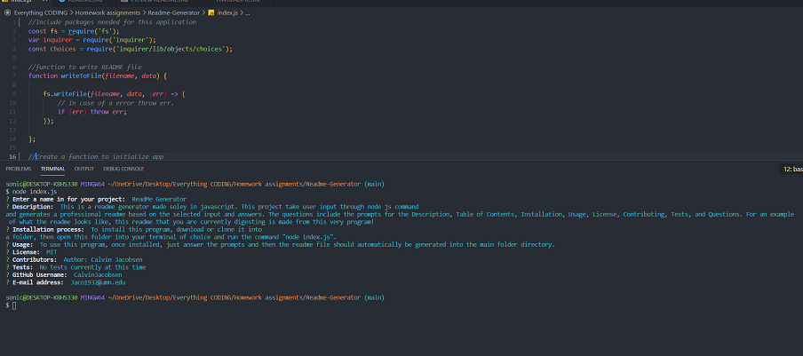

# ReadMe Generator 

## Table of Contents

- [Project Title](#project-title)
- [Description](#description)
- [Table of contents](#table-of-contents)
- [Installation Instructions](#installation)
- [Usage Information](#usage)
- [Contributions](#contribute)
- [Questions](#questions)
- [Tests](#tests)
- [License](#license)

## Description 

 This is a readme generator made soley in javascript. This project take user input through node js command line prompts using 'Inquirer' and generates a professional readme based on the selected input and answers. The questions include the prompts for the Description, Table of Contents, Installation, Usage, License, Contributing, Tests, and Questions. For an example of what the readme looks like, this readme that you are currently digesting is made from this very program! 

## Installation Instructions 

 To install this program, download or clone it into a folder, then open this folder into your terminal of choice and run the command "node index.js". 

## Usage Information 

 To use this program, once installed, just answer the prompts and then the readme file should automatically be generated into the main folder directory. 
 An image example of what you would expect from the prompts and typical responses BELOW: \\/\\/\\/   
 

 Click the link to see an example of the program in action! --> https://drive.google.com/file/d/1nIjzYV1GVlSjHNjEx3GnTZC4_uQAzmaB/view

## Contributions 

 Author: Calvin Jacobsen 

## Questions 

 You can ask your questions by messaging me on Github at -> https://github.com/CalvinJacobsen  
 or by emailing me at -> Jaco1932@umn.edu

## Tests 

 No tests currently at this time 

 [(Back to top)](#table-of-contents)